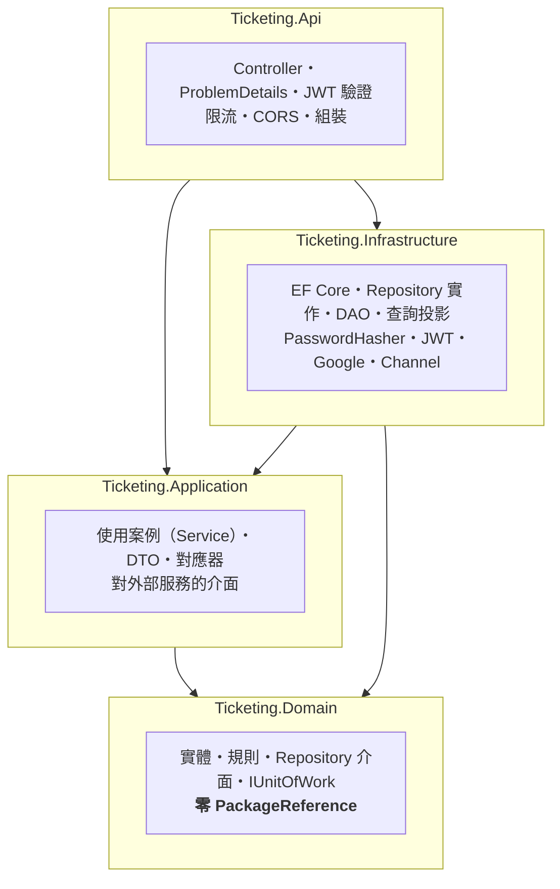
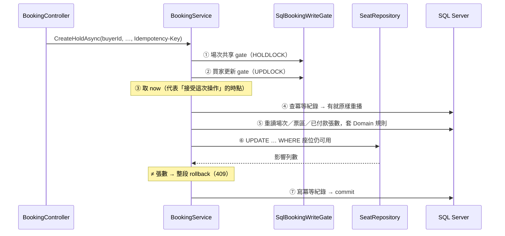

# 線上購票系統

劃位購票網站：15 場虛構活動（12 場演唱會、3 場運動賽事）、2,880 個座位，含註冊登入、選座保留、模擬付款、訂單查詢與管理後台。

後端刻意做完整的分層與一致性保證：**Clean Architecture 四專案、Repository／DAO、DTO ＋ 對應層、IoC、資料庫交易、稽核、冪等**。功能範圍收斂，工程責任完整。

> **票券無實際入場效力。** 本站不處理真實金流，付款為模擬流程。

[](https://github.com/zach0627/ticketing/actions/workflows/ci.yml)

**線上版：<https://gentle-plant-0058db400.6.azurestaticapps.net>**

> 第一次開啟大約要等一分鐘。資料庫用的是 Azure SQL 的免費額度，閒置後會自動暫停以節省費用，
> 第一個請求要等它醒來（實測 54 秒）。這是刻意接受的取捨——換來的是額度用完自動停機、不會產生費用。
> 頁面在載入超過幾秒後會把原因顯示出來。

---

## 這個專案在解決什麼

三個在「訂票」這件事上真正困難的問題，而且每一個都有**可執行的證據**：

| 問題 | 做法 | 證據 |
|---|---|---|
| 一席不能賣給兩個人 | 帶條件的 `UPDATE` ＋ 比對影響列數，不是「先查再寫」 | T01：50 個帳號並行搶同一席 → 1 成功、49 個 409，資料庫只有一筆 |
| 同一個人不能超過每人上限 | 交易內先鎖買家，再重讀已付款張數 | T16：付款停在 gate 內時另開一筆保留，必須排在後面並重讀 |
| 網路重送不能變成第二次購買 | `Idempotency-Key` ＋ 指紋（含目標資源，不只 body） | T21：commit 成功但回應遺失，同 key 重送拿到**原本那一張**訂單 |

「防超賣」的細節寫在 [`AGENTS.md`](AGENTS.md)；設計與逐步解說在另一個 repo 的 Obsidian 筆記。

---

## 目前進度

| 階段 | 內容 | 狀態 |
|---|---|---|
| 1 | 骨架：方案、七個專案、中央套件管理、CI | ✅ |
| 2 | Domain：實體、規則、Repository 介面 | ✅ |
| 3 | Infrastructure：EF、migration、seed | ✅ |
| 4 | 公開瀏覽（第一條垂直切片） | ✅ |
| 5 | 註冊登入（密碼 ＋ Google） | ✅ |
| 6 | 保留與付款 | ✅ |
| 7 | 管理後台與背景通知 | ✅ |
| 8 | Azure 部署 | ✅ |
| 9 | 面試包裝（README、展示腳本、Q&A 對照） | ✅ |

---

## 架構



**依賴方向只朝內，而且由編譯器保證**：在 `Ticketing.Application` 寫 `using Microsoft.EntityFrameworkCore;` 會得到 `error CS0234`——它根本沒有那個參照。`tests/*/ArchitectureGuardTests.cs` 另外用測試釘住「Domain 零套件」與「Application 不碰 EF」。

一次購票寫入的路徑：



---

## 快速開始

需求：.NET 10 SDK、Node 22+、Docker。

```bash
# ① JWT 簽章金鑰（沒有的話 API 會刻意啟動失敗——少了金鑰的服務不該起得來）
cd src/Ticketing.Api && dotnet user-secrets set "Jwt:SigningKey" "$(openssl rand -base64 48)"

# ② 資料庫連線字串與 seed 密碼也放 user-secrets，指令見 AGENTS.md
dotnet ef database update --project src/Ticketing.Infrastructure --startup-project src/Ticketing.Api
dotnet run --project src/Ticketing.Api -- seed

# ③ 兩個終端機
dotnet run --project src/Ticketing.Api --urls http://localhost:5080
cd web && cp .env.example .env && npm run dev     # http://localhost:5173
```

```bash
dotnet build          # 0 警告 0 錯誤（TreatWarningsAsErrors）
dotnet test           # 261 個測試
```

---

## 測試

| 層 | 數量 | 證明什麼 | 工具 |
|---|---|---|---|
| `Ticketing.Domain.Tests` | 84 | **規則對**：狀態機、到期邊界、上限、連號搜尋 | xUnit，純物件，秒級 |
| `Ticketing.Application.Tests` | 66 | **流程對**：哪個條件丟哪個錯、哪個相依**沒有**被呼叫 | ＋ NSubstitute ＋ FakeTimeProvider |
| `Ticketing.Api.Tests` | 114 | **資料對**：併發、冪等、約束、授權、重置 | ＋ WebApplicationFactory ＋ Testcontainers（真 SQL Server） |

併發測試不是「同時發幾個請求看結果」——關鍵案例用**測試裝飾器把一方停在已取得資料庫鎖的那一刻**，讓另一方確實排隊，再放行，而且兩個方向各跑一次。「commit 成功但回應遺失」用 EF 的交易攔截器做出來。

> 開發機是 Apple Silicon，SQL Server 容器在 arm64 上是 Microsoft 官方未支援的模擬環境。
> **併發正確性的權威結果以 CI 的 x86-64 runner 為準**（`.github/workflows/ci.yml` 的 `integration` job）。

---

## 刻意的取捨

面試時會主動講的，不等人問：

- **同場次熱門座位的寫入會在資料庫的列鎖排隊。** 沒有量測過吞吐量，所以不寫任何數字。
- **沒有 refresh token、沒有 Email 驗證、沒有帳號鎖定與 MFA。** access token 兩小時，過期重新登入。
- **同一個 Email 不能同時有密碼與 Google 登入**，避免帳號接管風險；換方式第一版不提供。
- **背景通知會掉。** 有界佇列、程序重啟就丟——沒有任何票務狀態依賴它；要保證送達得換 Outbox。
- **「一鍵重置」是展示功能**，商用系統不會有刪掉所有訂單的按鈕。
- **四個專案的代價**是介面與跨專案跳轉；換來的是依賴方向由編譯器保證、以及不連資料庫就能測流程。
- **雲端跑在免費層**：App Service F1（每日 60 CPU 分鐘、無 Always On）＋ Azure SQL serverless（閒置自動暫停）。不能拿它做壓測，第一個要換掉的是 F1。
- **限流在雲端會退化成全站共用額度**。App Service 上沒辦法列舉可信代理位址，而清空 `KnownProxies` 等於相信任何人送來的 `X-Forwarded-For`——那會讓限流形同虛設。所以刻意不啟用 `ForwardedHeaders`，代價講明白。

每一項的升級路徑都寫在設計文件裡。

---

## 機密

repo 內沒有任何機密。本機設定走 `dotnet user-secrets`（存在 `~/.microsoft/usersecrets/`，在 repo 之外），雲端走 App Service 應用程式設定。三道防線：`.gitignore`、GitHub Push Protection、CI 的 gitleaks job。

雲端這條線上**沒有任何長期密鑰**：

| 連線 | 憑證 |
|---|---|
| GitHub Actions → Azure | OIDC federated credential（短期 token，不是 publish profile） |
| App Service → Azure SQL | System-assigned Managed Identity（連線字串裡沒有密碼；SQL 伺服器是 Entra-only 驗證） |
| 部署身分的權限 | Website Contributor，scope 只在那一個 Web App |

Google Client ID 是公開值，會出現在前端原始碼與每一個網路請求裡，這是設計上正確的。
