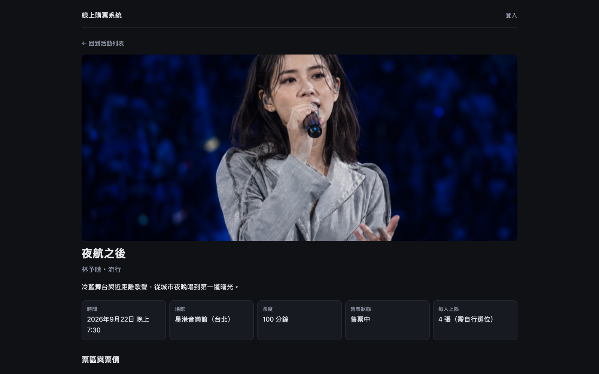
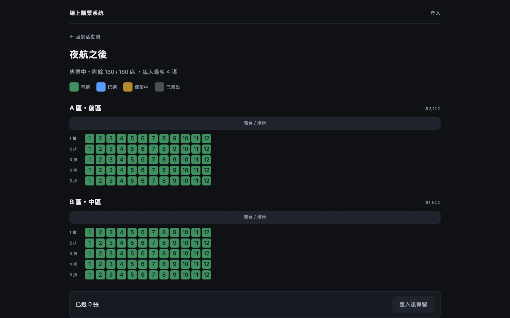
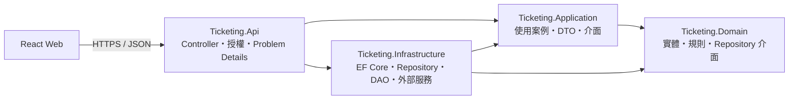

# 線上購票系統

劃位購票網站，提供活動瀏覽、註冊登入、選座保留、模擬付款、訂單查詢與管理後台。內含 15 場虛構活動與 2,880 個座位。

> **票券無實際入場效力。** 本站不處理真實金流，付款為模擬流程；活動、演出者與場館皆為虛構。

[](https://github.com/zach0627/ticketing/actions/workflows/ci.yml)

**線上版：<https://gentle-plant-0058db400.6.azurestaticapps.net>**

雲端使用 Azure 免費層。資料庫閒置後會自動暫停，因此第一次載入可能需要約一分鐘；頁面會在等待期間說明目前狀態。

## 畫面

### 活動列表

瀏覽 15 場活動，並依演唱會或運動賽事篩選。


### 活動詳情

查看活動介紹、場次、場館、售票狀態、票區價格與每人購票上限。



### 選擇座位

依票區與排號選位，並區分可選、已選、保留中及已售出狀態。



## 功能

### 使用者

- 依分類瀏覽活動、查看場次與票區。
- 使用 Email／密碼或 Google 登入。
- 手動選位或由系統安排連號座位。
- 保留座位五分鐘，期間可完成模擬付款或取消保留。
- 查詢訂單與票券明細。

### 管理

- 查看訂單、售票數、收入與有效保留。
- 暫停或恢復單一場次售票。
- 重置購票資料並將活動日期平移至未來。

### 系統保證

- 以資料庫條件更新、唯一索引與交易避免同一座位被重複售出。
- 以 `Idempotency-Key` 處理保留、付款與管理操作的網路重送。
- 在交易內重新檢查每人上限，避免並行請求繞過規則。
- 統一以 Problem Details 回傳錯誤代碼與追蹤 ID。
- JWT 授權、角色權限、CORS 與分區限流皆由 API 執行。

## 架構

前端與 API 分開部署；後端採 Clean Architecture，依賴只朝內層移動。



| 區域 | 技術與責任 |
|---|---|
| Web | React 19、TypeScript、Vite、React Router、TanStack Query |
| Api | ASP.NET Core 10、JWT、Problem Details、Rate Limiting |
| Application | 使用案例協調、DTO、Mapperly 對應、外部服務介面 |
| Domain | 實體、購票規則與 Repository 介面；零套件依賴 |
| Infrastructure | EF Core、SQL Server、Repository／DAO、身分與背景處理 |
| Tests | xUnit、NSubstitute、WebApplicationFactory、Testcontainers |

購票寫入固定依序取得場次與買家 gate，再檢查冪等紀錄、重新載入規則所需資料並執行條件更新；整段在同一個資料庫交易中完成。Controller 不直接操作 `DbContext`，Application 也不依賴 EF Core 或 `HttpContext`。

## 快速開始

需求：.NET 10 SDK、Node.js 22+ 與 SQL Server。執行 API 整合測試時另需 Docker；SQL Server 容器的權威結果以 CI 的 x86-64 runner 為準。

### 1. 設定後端

機密只存放在 .NET user-secrets。請先準備可用的本機 SQL Server 連線字串與管理者密碼。

```bash
cd src/Ticketing.Api

dotnet user-secrets set "ConnectionStrings:Ticketing" "YOUR_VALUE_HERE"
dotnet user-secrets set "Jwt:SigningKey" "$(openssl rand -base64 48)"
dotnet user-secrets set "Seed:Admin:Email" "admin@example.test"
dotnet user-secrets set "Seed:Admin:Password" "YOUR_VALUE_HERE"

cd ../..
dotnet tool restore
dotnet ef database update \
  --project src/Ticketing.Infrastructure \
  --startup-project src/Ticketing.Api
dotnet run --project src/Ticketing.Api -- seed
```

API 不會在啟動時自動執行 migration 或 seed；缺少 JWT 簽章金鑰時也會刻意拒絕啟動。

### 2. 啟動 API

```bash
dotnet run --project src/Ticketing.Api --urls http://localhost:5080
```

### 3. 啟動前端

另開一個終端機：

```bash
cd web
cp .env.example .env
npm ci
npm run dev
```

開啟 <http://localhost:5173>。前端與 API 使用不同 origin，本機環境會實際經過 CORS。

## 驗證

不需要 Docker 的後端驗證：

```bash
dotnet build --configuration Release
dotnet test tests/Ticketing.Domain.Tests --no-build --configuration Release
dotnet test tests/Ticketing.Application.Tests --no-build --configuration Release
```

需要 Docker 與 SQL Server 容器的 API 整合測試：

```bash
dotnet test tests/Ticketing.Api.Tests --configuration Release
```

前端驗證：

```bash
cd web
npm ci
npm run lint
npm run build
```

CI 會在 x86-64 runner 上執行全部建置、單元測試、整合測試、前端檢查、命名守門與機密掃描；通過後才會部署 API 與 Web。
